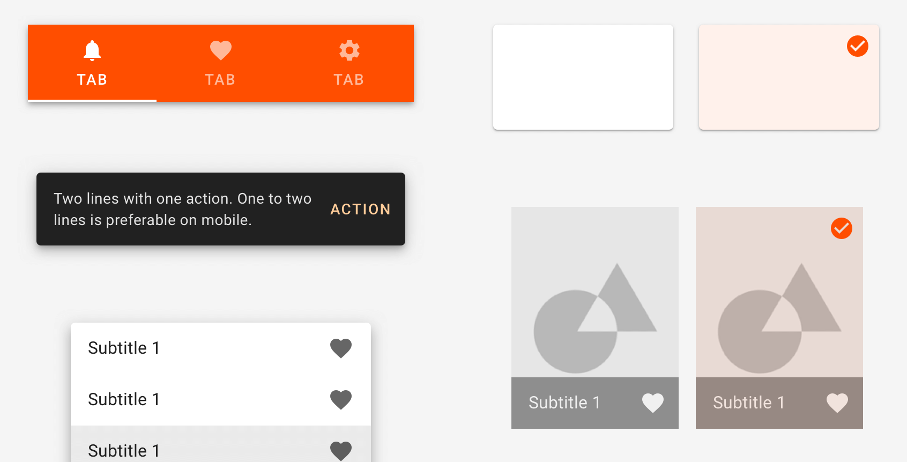

# INDI-Material

This package contains the INDI themed resources for the [Material](https://material.io) design system.



## Installation

``` shell
npm install @indi/material
```

## Usage

This package supports (recommends) SCSS, but a minified CSS version is available in `dist/indi-material.min.css`.

``` scss
// Use default values (recommended)
@use "@indi/material/theme";

// Or with custom configuration
@use "@indi/material/theme" with (
    $primary: blue,
    ...
);
```

## Testing

``` shell
npm test [-- --watch]
```

## Contributing

Commit and push changes to git remote tagged with the new version.

``` shell
git add .
git commit -m "new release"
git tag v1.1.0
git push origin master --tags
```

Publish the package to NPM.

``` shell
npm version from-git
npm publish
```
